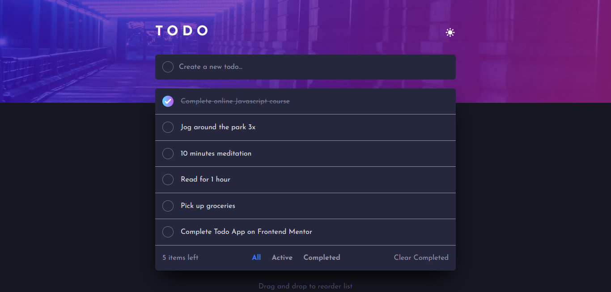
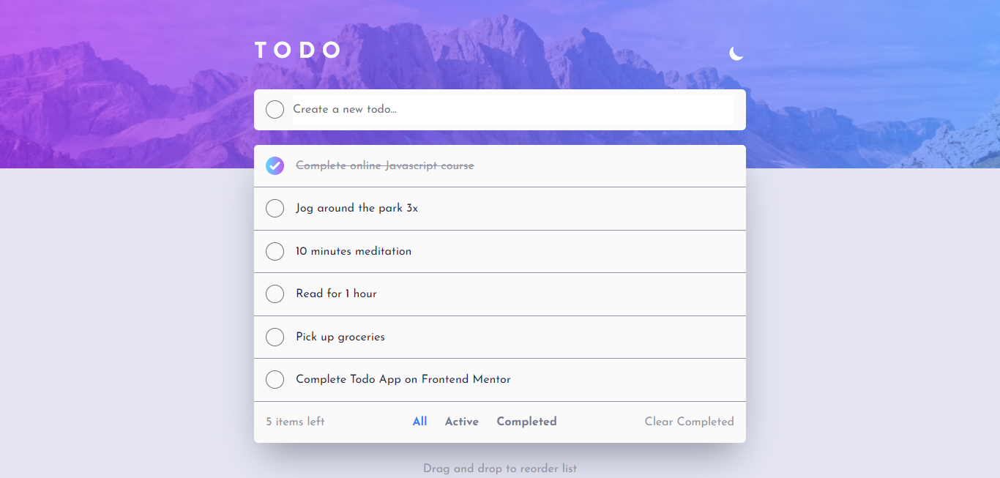

# Frontend Mentor - Todo app solution

This is a solution to the [Todo app challenge on Frontend Mentor](https://www.frontendmentor.io/challenges/todo-app-Su1_KokOW). Frontend Mentor challenges help you improve your coding skills by building realistic projects.

## Table of contents

- [Frontend Mentor - Todo app solution](#frontend-mentor---todo-app-solution)
  - [Table of contents](#table-of-contents)
  - [Overview](#overview)
    - [The challenge](#the-challenge)
    - [Screenshot](#screenshot)
    - [Links](#links)
    - [Commands](#commands)
  - [My process](#my-process)
    - [Built with](#built-with)
    - [What I learned](#what-i-learned)
    - [Continued development](#continued-development)
    - [Useful resources](#useful-resources)
  - [Author](#author)
  - [Acknowledgments](#acknowledgments)

## Overview

### The challenge

Users should be able to:

- View the optimal layout for the app depending on their device's screen size
- See hover states for all interactive elements on the page
- Add new todos to the list
- Mark todos as complete
- Delete todos from the list
- Filter by all/active/complete todos
- Clear all completed todos
- Toggle light and dark mode
- **Bonus**: Drag and drop to reorder items on the list

### Screenshot





### Links

- Solution URL: [My Solution on Frontend Mentor](https://your-solution-url.com)
- Live Site URL: [Live Site](https://dees-todolist.netlify.app/)

### Commands

Feel free to fork or clone directly :). You could drop a star if you like the solution 💙

`
git clone https://github.com/Multimarix/todolist-app-w-dnd.git

npm install

npm run dev
`

## My process

### Built with

- Semantic HTML5 markup
- CSS custom properties
- Flexbox
- Mobile-first workflow
- [React](https://reactjs.org/) - JS library
- [Typescript](https://www.typescriptlang.org/docs/handbook/intro.html) - Typescript
- [Tailwind Css](https://tailwindcss.com/docs/installation) - For styles
- [Zustand](https://github.com/pmndrs/zustand) - State Management Library

### What I learned

I learned to use a couple things for the first time in this project. Some of them were, Zustand and Jotai for state management in the application. I also used @dnd-kit for making draggable and droppable copmonents for the first time in this project. In short, it was a really enjoyable learning experience for me this one😁.

```js
set((state) => {
  if (state.activeTab === "all") {
    state.todos = reArrangedTodos;
    state.allTodos = reArrangedTodos;
  } else if (state.activeTab === "active") {
    state.todos = reArrangedTodos;
    state.activeTodos = reArrangedTodos;
  } else {
    state.todos = reArrangedTodos;
    state.completedTodos = reArrangedTodos;
  }
});
```

### Continued development

To be honest, this is not where I want this project to finally be. I plan to tinker with the @dnd-kit library a little more and make some improvements to the UX of the application. I plan to provide support for checking and unchecking the checkbox with your keyboard alone as I think that would lead to better UX. That is just one among the few updates I want to make to the application going forward.

### Useful resources

- [The dnd kit Official Docs](https://docs.dndkit.com/) - The dnd-kit official docs website is really good in my opinion.
- [dnd-kit codesandbox examples](https://codesandbox.io/examples/package/@dnd-kit/core) - This was a good one for reference and for demos but the example I saw for my use-case wasn't really beginner friendly. I wish it could be a bit better.
- [The Zustand Github Repo Docs and examples](https://github.com/pmndrs/zustand) - This was another good reference point for using Zustand. I really like Poimandres now.

## Author

- Github - [Multimarix](https://github.com/Multimarix)
- Frontend Mentor - [@Multimarix](https://www.frontendmentor.io/profile/Multimarix)
- LinkedIN - [Don Akhirebhulu](https://www.linkedin.com/in/don-akhirebhulu-675082242/)

## Acknowledgments

Thanks to Frontend Mentor for the Project once again. I really enjoyed it🤞🏾👌🏾.
